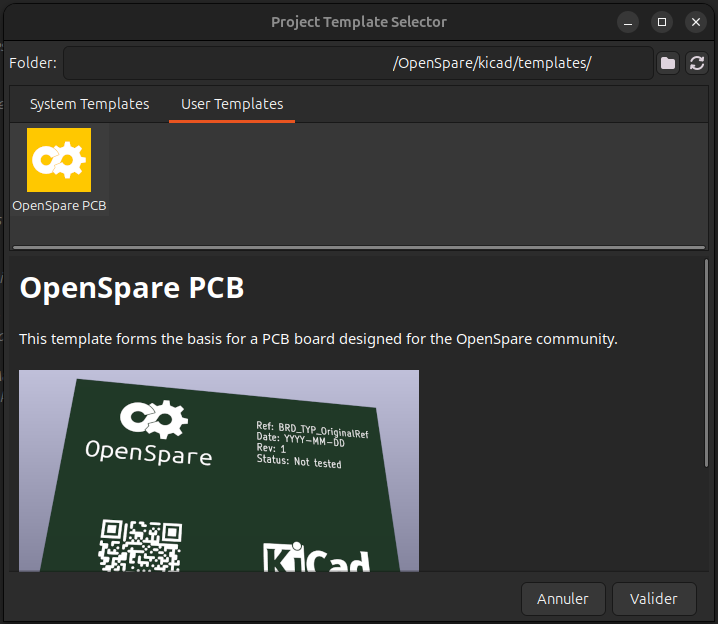
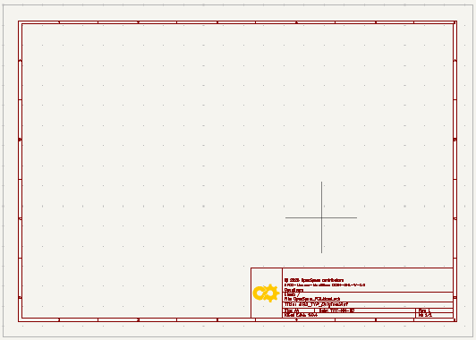
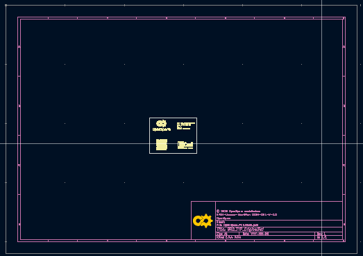

# Contributing to OpenSpare

All contributions are welcome! Here's how you can help:

- Adding new parts (PCB, 3D, documentation)
- Improving existing designs
- Manufacturing, testing and sharing feedback

## Guidelines - PCB design

This section describes how to contribute by designing a new PCB.

### Project creation

Create a project using KiCad version >= 9.0.

Open KiCad, then do 'File' > 'New Project From Template...' or press Ctrl+T.

A window 'Project Template Selector' pops up. Select the tab 'User Templates' and browse to select the folder kicad/templates in OpenProject repo. The OpenSpare logo should show up above the template name 'OpenSpare PCB' as in the following picture:



Select it and validate.

You can now save your own project.

### Where to save my project?

OpenSpare's 'parts' folder is aimed to store your design project and all fabrication outputs.

Name your project this way "*XXX_YYY_Reference*" where:
- *XXX* is the appliance's brand code name (example: *SMG* for samsung)
- *YYY* is the type of the appliance (example: *OVN* for oven)
- *Reference* is the original reference of the part (not the product/appliance)

Save your project in the following folder: OpenSpare/parts/"brand of the appliance"/"type of appliance" and check the box "**Create a new folder for my project**" before saving. This way, design files will be stored in OpenSpare/parts/"brand of the appliance"/"type of appliance"/"*XXX_YYY_Reference*".

### The PCB project

This template is made of:
- 1 schematics file XXX_YYY_Reference.kicad_sch
- 1 pcb design file XXX_YYY_Reference.kicad_pcb
- 1 project file XXX_YYY_Reference.kicad.pro
- 1 preference file XXX_YYY_Reference.kicad_prl (automatically created by KiCad - not tracked in the repo)

Those are standards KiCad files. Please refer to KiCad's documentation for further descriptions.

Schematics and PCB files are made of drawing sheet template you can find in OpenSpare/kicad/templates/OpenSpare_A3_drawing_sheet.kicad_wks.

- Schematics:



- PCB:



### OpenSpare libraries

OpenSpare libraries (symbols and footprints) are available in OpenSpare repo:
- Symbol: OpenSpare/kicad/components/OpenSpare_symbols.kicad_sym
- Footprints: OpenSpare/kicad/components/OpenSpare_footprints.pretty

See KiCad's documentation to manage them.

## Contributor Attribution

As a designer, you can credit yourself for your contribution. This will display your GitHub profile picture, username, and optionally a tip link (e.g., Buy Me a Coffee) on the OpenSpare website.

### How to add your attribution

Create a file named `AUTHOR.yml` in the root of your design folder (e.g., `parts/samsung/oven/SMG_OVN_DE96-00994A/AUTHOR.yml`).

### AUTHOR.yml format

```yaml
github: https://github.com/yourusername
tip_url: https://buymeacoffee.com/yourusername
tip_label: Buy me a coffee
```

**Fields:**
- `github` (required): Your GitHub profile URL. Your profile picture and display name will be fetched automatically.
- `tip_url` (optional): A link where people can tip you (Buy Me a Coffee, Ko-fi, PayPal, etc.)
- `tip_label` (optional): Custom label for the tip button. Defaults to "Tip" if not specified.

### Where it appears

Your attribution will be displayed:
- On part cards in the Parts Catalog
- On news cards when your part is featured
- On the detailed news post page
